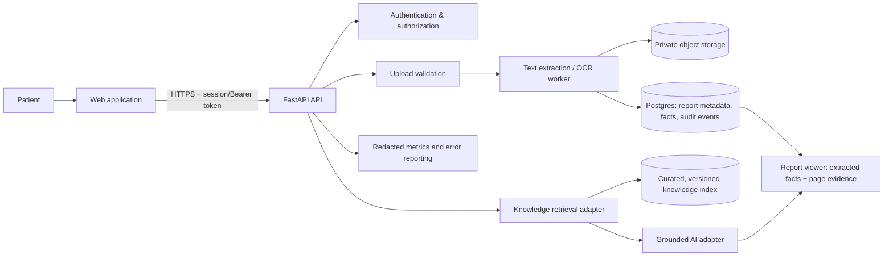

# MediQuery architecture

## Design status

This document describes the target architecture and the small production foundation implemented in this repository. It is intentionally lean: it does not require Pinecone, Kubernetes, or a large service mesh. Components marked **planned** are not currently provided by the code.

## Principles

- Treat every uploaded report as highly sensitive.
- Keep extraction deterministic and evidence-backed; do not turn unverified model output into a medical fact.
- Enforce identity and ownership at the API boundary.
- Keep vendor-specific AI, storage, email, observability, and billing integrations behind small adapters.
- Prefer managed Postgres and private object storage in deployment; retain SQLite only for local development/tests.

## System shape

## Trust boundaries and data flow

1. An authenticated user uploads a document over TLS. The API limits bytes, verifies an allowlisted PDF signature/type, assigns a generated ID, and never exposes a public object URL.
2. A worker extracts text page-by-page. OCR is **planned** for scanned PDFs. Extraction emits a structured report record, value candidates, source page/evidence, and explicit processing state.
3. Persisted report metadata is scoped by `user_id`. Every read, delete, chat, and download first proves that scope server-side.
4. Generic medical knowledge is stored separately from patient reports. Retrieval carries source, publisher, version, URL/licence, chunk ID, and relevance score; untrusted report text is never treated as system instruction.
5. An AI response is optional and must consume only bounded, attributed evidence. The UI labels “extracted from report” separately from “general educational information.”
6. Deletion tombstones the database record and queues private-object deletion. In production, retention and backup deletion must be configured with the storage provider.

## Implemented foundation

- FastAPI API configuration with explicit CORS allowlist and security headers.
- Environment validation and fail-closed production settings.
- Password-hash/JWT authentication helpers and owner-scoped data-access design.
- SQLAlchemy models for users, reports, extracted findings, and non-PHI audit events.
- Validated PDF upload/processing primitives and a structured report schema.
- A deterministic lab-value parser that preserves value, unit, range, flag, and page evidence when present.
- A plan/entitlement abstraction, private-storage interface, redacted event interface, and testable service boundaries.

## Planned deployment topology

| Environment | Database | Report objects | Async work | Notes |
| --- | --- | --- | --- | --- |
| Local development | SQLite | local private directory | in-process/manual | synthetic data only |
| Initial production | managed Postgres | managed private encrypted object storage | managed queue/worker | single API region, backups and alerts |
| Scale-out | managed Postgres with replicas | same | autoscaled workers | only after measured queue/load need |

Do not expose Postgres, Redis, dashboards, object storage, or worker control planes to the public internet. Configure provider encryption, backups, access logs, network restrictions, and a data-processing agreement before processing real reports.

## AI and retrieval design

The current repository has local FAISS utility classes but no integrated, trustworthy RAG product flow; it does **not** contain Pinecone or Gemini. The recommended retrieval contract is:

- Ingest only approved, licence-reviewed medical sources.
- Chunk by heading/semantic boundary with a bounded overlap; store title, publisher, URL, publication/review date, licence, version, and chunk ID.
- Retrieve within a fixed token budget; discard scores below an evaluated threshold and return no answer rather than fill gaps.
- Pass retrieved text as quoted *reference material*, never as instructions; delimiter-wrap it and instruct the model to ignore embedded directives.
- Require each educational claim to cite returned source IDs. If evidence is absent, say so.
- Do not index one user’s report into a shared knowledge collection. Patient-report Q&A uses that report’s owner-scoped evidence only.

## Operational interfaces

`Settings` is the single environment boundary. Storage, billing, AI, and observability must receive configuration server-side; browser code must receive no provider secret. The API uses typed request/response schemas and emits stable safe error codes. Production use requires a managed error reporter and metric sink configured to redact PHI.

## Why this architecture is cost-conscious

The first deployable version needs one API service, one worker, managed Postgres, and private object storage. It avoids running Elasticsearch, Weaviate, Grafana, Prometheus, and Flower until observed requirements justify them. A managed provider reduces operational burden, but its contractual, geographic, encryption, and compliance characteristics still require independent review.
