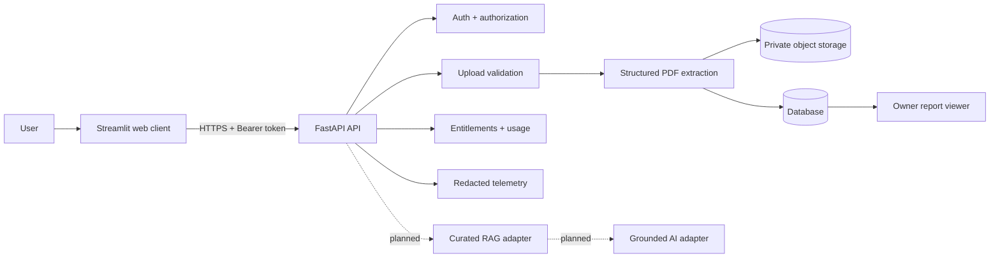

# MediQuery

MediQuery is a privacy-conscious medical-report organization application. It accepts authenticated **text-based PDF** uploads, validates them server-side, extracts conservative structured candidates such as values, units, reference ranges, explicit flags, page numbers, and source evidence, and lets the report owner review or delete the result.

> **Medical safety boundary:** MediQuery is an educational report-organization tool. It is **not** a diagnostic service, emergency service, doctor replacement, or clinically validated medical device. Extracted candidates must be checked against the original report and discussed with a qualified healthcare professional.
>
> The repository does **not** claim HIPAA, PIPEDA, PHIPA, GDPR, SOC 2, or any other compliance certification.

## Product status

**Current release:** production-shaped engineering foundation; not approved for real patient/PHI processing.

### Implemented today

- FastAPI backend with signup/login and owner-scoped report access.
- Server-side PDF validation for extension, advisory MIME type, magic bytes, size, page count, encryption, and malformed content.
- Private generated storage keys rather than public report URLs.
- Conservative structured extraction with value, unit, reference range, explicit flag, page, and evidence fields.
- Authenticated report history, detail, report deletion, and account deletion.
- Responsive Streamlit client for onboarding, upload, review, and deletion.
- Medical-limitations acknowledgement at account creation.
- Server-side Free/Pro entitlement boundaries and durable usage metering; billing is not enabled.
- Request IDs, PHI-conscious aggregate metrics, safe errors, rate-limit telemetry, and protected operational metrics.
- CI quality gate for formatting, linting, tests, compilation, and credential-shaped secret scanning.
- Containerized local deployment path and documented production deployment requirements.

### Explicitly not implemented

- Gemini or another production generative-model integration in the protected report flow.
- Pinecone or a populated production medical RAG knowledge base.
- Clinical diagnosis or clinical decision support.
- OCR for scanned PDFs.
- Live Stripe/payment processing, webhooks, invoices, refunds, or tax handling.
- A production Next.js/React application; the current client is Streamlit.
- Managed production storage/database/monitoring infrastructure.
- Clinical validation, regulatory clearance, compliance certification, or real-customer traction.

These boundaries are intentional. The project avoids presenting experimental or placeholder AI behavior as a medical product capability.

## What the user experience looks like

1. **Create an account** and acknowledge the product's medical limitations.
2. **Upload a text-based PDF** within the configured size/page limits.
3. **Process the report** through server-side validation and extraction.
4. **Review extracted candidates** with their units, reference ranges, flags, page numbers, and source evidence.
5. **Compare against the original report** and use the information as preparation for a conversation with a qualified clinician.
6. **Delete the report** when it is no longer needed.

### Screenshots and demo

No hosted production demo or verified product screenshots are included in this repository yet. This is deliberate: screenshots should be captured from a deployed staging build rather than fabricated or presented as evidence of a production deployment.

For a local product walkthrough, run the backend and Streamlit client using the instructions below and use **synthetic data only**.

## Architecture

MediQuery follows a deliberately small API → validation/extraction → private storage/database → owner-scoped viewer flow. Vendor-specific AI, storage, billing, retrieval, and observability capabilities are designed as replaceable boundaries rather than hard-coded product dependencies.



See [ARCHITECTURE.md](ARCHITECTURE.md) for trust boundaries, data flow, deployment topology, and planned AI/retrieval interfaces.

## Tech stack

| Layer | Technology | Role |
| --- | --- | --- |
| API | FastAPI | Authentication, authorization, report APIs, validation, entitlements |
| Client | Streamlit | Lightweight authenticated user interface |
| Data | SQLAlchemy + SQLite/Postgres | Users, reports, findings, usage, subscriptions, audit metadata |
| Documents | `pypdf` and validation utilities | Text-based PDF parsing and validation |
| Auth | Password hashing + JWT | Account authentication and bearer-token authorization |
| Packaging | Docker / Docker Compose | Local production-shaped smoke environment |
| Quality | Black, Flake8, Pytest, Compileall | Repeatable CI quality gate |
| Retrieval | Local FAISS utilities | Exploratory foundation; not a production RAG service |

## Repository map

```text
.
├── src/
│   ├── api/                 # FastAPI application and routes
│   ├── models/              # SQLAlchemy persistence models
│   ├── schemas/             # Pydantic request/response contracts
│   ├── services/            # Extraction, retrieval, billing, telemetry, etc.
│   └── ...
├── tests/                   # Synthetic API/unit/security tests
├── app.py                   # Streamlit client
├── ARCHITECTURE.md          # System design and trust boundaries
├── SECURITY.md              # Security/privacy posture and gaps
├── AI_SAFETY.md             # Medical-AI safety boundary and future controls
├── TESTING.md               # Test strategy and release-level gaps
├── DEPLOYMENT.md            # Deployment and infrastructure requirements
├── ACQUISITION.md           # Technical acquisition overview
├── BUYER_DUE_DILIGENCE.md   # Buyer risk assessment
└── PERFORMANCE.md           # Phase 12 measurements and trade-offs
```

## Local development

### Prerequisites

- Python 3.11+
- A virtual environment
- Docker Desktop is optional for the production-shaped smoke environment

### API

```bash
python -m venv .venv
.venv\\Scripts\\activate       # Windows PowerShell
pip install -r requirements.txt
Copy-Item .env.example .env
uvicorn src.api.main:app --reload --port 8000
```

### Streamlit client

In a second terminal:

```bash
streamlit run app.py
```

The client defaults to `http://localhost:8000`. Set `MEDIQUERY_API_URL` if the API is hosted elsewhere.

### Synthetic data only

Do **not** upload real patient reports during local development. The development SQLite database and local `private_uploads` directory are not suitable for real medical data.

## Environment configuration

Start from `.env.example`. Configuration is intentionally server-side for secrets.

Typical deployment settings include:

- `ENVIRONMENT`
- `DATABASE_URL`
- `JWT_SECRET`
- `CORS_ORIGINS`
- `UPLOAD_ROOT`
- `METRICS_TOKEN`
- Provider credentials only when the corresponding integration is actually enabled

Production configuration fails closed for insecure defaults such as a short/default JWT secret, SQLite, or HTTP CORS origins. Never commit `.env`, provider tokens, database credentials, uploaded reports, or generated local databases.

See [DEPLOYMENT.md](DEPLOYMENT.md) for the production-shaped deployment checklist and provider responsibilities.

## Security and privacy

Security controls currently include authentication, owner-scoped report access, server-side upload validation, generated private storage keys, deletion paths, security headers, explicit CORS, safe errors, request IDs, rate limiting, and PHI-conscious telemetry.

Those controls are **not** equivalent to regulatory compliance. Real-data deployment still requires managed encrypted storage/database, secret management, malware scanning, TLS/WAF controls, backups and restore testing, retention/deletion policies, incident response, legal/privacy review, provider agreements, and independent security/compliance assessment.

Read [SECURITY.md](SECURITY.md) before deploying the application with sensitive data.

## Medical AI safety

The current protected report flow deliberately avoids turning free-form model output into medical facts. Extracted candidates preserve the source value and page evidence, and unreadable/scanned reports produce explicit limitations rather than invented results.

Any future generative or RAG explanation feature must use curated, licence-reviewed sources, bounded retrieval, source attribution, tenant isolation, prompt-injection defenses, and medical-safety evaluation. See [AI_SAFETY.md](AI_SAFETY.md).

## Testing and quality gate

Run locally:

```bash
python -m black --check src tests app.py
python -m flake8 src tests app.py --max-line-length=120
python -m pytest -q
python -m compileall -q src app.py
```

The GitHub Actions workflow is the repeatable quality gate. Tests use synthetic reports and cover authentication, authorization, report ownership, PDF validation, extraction, deletion, rate limiting, telemetry, retrieval contracts, and billing boundaries.

See [TESTING.md](TESTING.md) for the complete scope and the provider/browser tests that remain before launch.

## Deployment

The repository includes a Docker Compose production-shaped smoke environment, but it is **not** a complete production deployment.

A real deployment should use:

1. Managed Postgres.
2. Private encrypted object storage.
3. TLS behind a reverse proxy/WAF.
4. Secret management and rotation.
5. Isolated asynchronous document processing.
6. Malware scanning and resource limits.
7. Backups and tested restores.
8. Managed monitoring and PHI-safe error reporting.
9. Database migrations and rollback procedures.
10. Legal/privacy/provider review before processing real medical reports.

See [DEPLOYMENT.md](DEPLOYMENT.md).

## Monetization readiness

The code has a server-side entitlement boundary for Free and Pro plans and durable usage events. This is a foundation for monetization, not evidence of paid customers or revenue.

Billing can later be connected through a payment-provider adapter. The application must derive paid status from verified provider events rather than browser claims. Live payment processing, webhook verification, invoices, refunds, tax handling, and provider contracts are not currently active.

## Roadmap

### Near term

- Managed Postgres/private object storage deployment.
- Versioned database migrations.
- Isolated asynchronous extraction workers.
- Malware scanning and production monitoring.
- Browser-level accessibility/responsive tests.
- Password reset/email verification and stronger session controls.

### Product validation

- OCR for scanned reports with measured extraction quality.
- Evaluated extraction datasets across realistic synthetic layouts.
- Curated, versioned, licence-reviewed medical knowledge retrieval.
- Source-attributed educational explanations only after safety evaluation.
- Human-factors and clinical review.

### Commercialization

- Payment provider integration and verified webhooks.
- Production web client if Streamlit no longer meets UX requirements.
- Customer research, pricing experiments, and support/operations workflows.
- Appropriate legal, privacy, security, and regulatory work for the chosen market.

## Licensing and intellectual property

There is currently **no repository licence grant**. Do not assume the project is MIT-licensed or otherwise freely reusable.

Before acquisition or commercial launch, perform a complete dependency/model/data licence inventory, confirm ownership and contributor rights, document provenance for any medical knowledge sources, and review trademarks and third-party intellectual-property obligations.

## Acquisition view

MediQuery's value proposition is the accumulated engineering foundation and documented path toward a focused medical-report workflow—not fabricated clinical claims or traction.

A buyer receives the source code, tests, architecture/security documentation, extraction pipeline, owner-scoped report workflow, entitlement abstraction, operational telemetry foundation, containerization, and a documented roadmap. A buyer does **not** receive guaranteed users, revenue, clinical validation, compliance certification, patents, exclusive datasets, or provider agreements.

See [ACQUISITION.md](ACQUISITION.md) and [BUYER_DUE_DILIGENCE.md](BUYER_DUE_DILIGENCE.md) for the acquisition assessment.

## Contact

For project questions, use the repository's GitHub issue/discussion channels. No separate commercial support or service-level agreement is currently provided.
